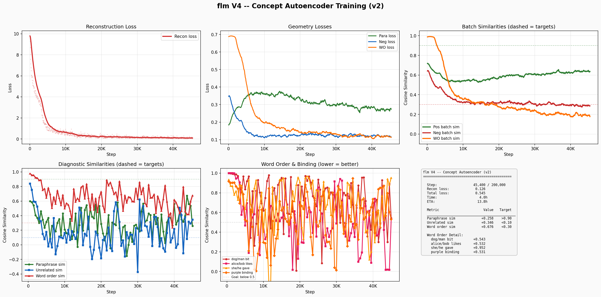
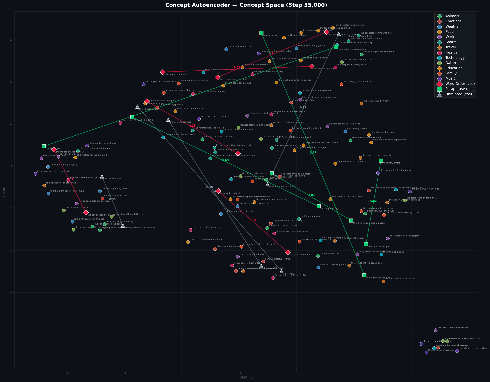
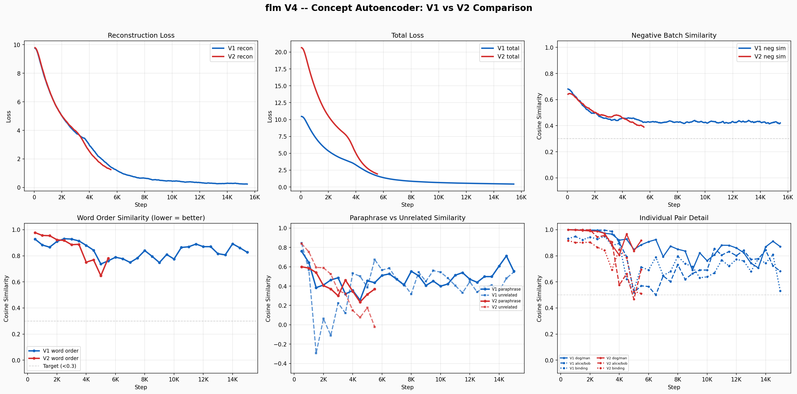

# flm — The Free Language Model

> **Status: Active training (Concept Autoencoder V2).** Training a concept autoencoder that compresses language into geometric concept vectors — a bottleneck where meaning determines position, not surface form.

A fully free AI project trained from scratch on a single RTX 3090. Every dataset DFSG-compliant, every weight reproducible. Built to be the first AI model you can `apt install` from Debian main.

**Free as in freedom** — the name is a direct reference to the Free Software Foundation's philosophy that software freedom is a matter of liberty, not price.

## Concept Autoencoder — Current Architecture

### The Idea

Instead of predicting tokens, encode language into a compressed geometric space where:
- **Paraphrases** map to nearby vectors (same meaning = close)
- **Unrelated sentences** map far apart
- **Word-order changes** that alter meaning (e.g., "dog bit man" vs "man bit dog") are distinguishable

A stage 2 model (future) can then reason purely in concept space, never touching raw language.

### Architecture (~54.8M params)

Encoder (bidirectional) -> 8x128 Bottleneck -> Decoder (autoregressive)

| Component | Details |
|-----------|---------|
| Encoder | 6 layers, 512 hidden, 8 heads, SwiGLU FFN |
| Bottleneck | 8 learned queries cross-attend to encoder, project to 128-dim each |
| Decoder | 6 layers, 512 hidden, 8 heads, cross-attends to concept stack |
| Concept space | 8 slots x 128 dims = 1024-dim representation |
| Tokenizer | BERT base uncased (30,522 vocab) |
| Max sequence | 128 tokens |
| Positional encoding | RoPE |
| Normalization | RMSNorm |

### Training Losses

Four losses trained jointly with scheduled weights:

1. **Reconstruction** (cross-entropy): Decode concept vectors back to original tokens. Forces the bottleneck to encode ALL meaning.
2. **Paraphrase** (contrastive): Pull paraphrase pairs closer in concept space.
3. **Negative** (contrastive): Push unrelated pairs apart.
4. **Word-order** (contrastive): Swap 2 random content tokens, push original and swapped apart. Teaches positional sensitivity without the shortcut of detecting "scrambled mess" n-grams.

**Scheduled weights** prevent geometry loss collapse:
- Phase 1 (recon > 2.0): Heavy reconstruction, light geometry
- Phase 2 (recon 1.0-2.0): Balanced
- Phase 3 (recon < 1.0): Heavy geometry, light reconstruction

### Training Data (DFSG-compliant)

| Dataset | License | Pairs | Use |
|---------|---------|-------|-----|
| ParaNMT | CC-BY | ~5M | Paraphrase pairs |
| PAWS | Apache 2.0 | 108K | Hard paraphrase pairs |
| QQP | CC | 400K | Question paraphrases |
| Tatoeba | CC-BY | 350K | Cross-lingual pairs |

### Training Progress (V2, step ~35K / 200K)

Concept autoencoder V2 uses minimal 2-token swap for word-order training and scheduled loss weights. Currently at ~17% through training.

**Training Dashboard (V2)**



**Concept Space Visualization (Step 35K)**

158 sentences from 13 semantic categories projected to 2D with UMAP. Lines connect special pairs (word-order, paraphrase, unrelated) with cosine similarity labels.



**V1 vs V2 Comparison**

V1 had no word-order loss and static weights. V2 added minimal 2-token swap contrastive loss and scheduled weight phases.



### Key Observations So Far

- **Reconstruction**: 5/5 perfect on diagnostic sentences at best evals
- **Unrelated separation**: Working well (cosine sim near 0 or negative)
- **Word-order sensitivity**: Improving but bouncy on specific diagnostic pairs
- **Paraphrase recognition**: Weakest signal — batch similarities improving but diagnostic pairs still noisy
- **Geometry equilibrium**: Para loss ~0.35, neg loss ~0.15, WO loss just above neg — healthy competing-forces balance

### Quick Start

```bash
# 1. Build paraphrase pair datasets
python build_pairs.py

# 2. Train concept autoencoder
python train_concept.py --fresh

# 3. Visualize concept space
python plot_concepts.py                    # static plot (latest checkpoint)
python plot_concepts.py --animate          # video across all checkpoints

# 4. Training dashboard
python plot_training.py --run v2           # V2 dashboard
python plot_training.py --compare          # V1 vs V2 comparison
```

## Version History

### Concept Autoencoder V2 (current) — Scheduled Weights + Word-Order Loss
- 54.8M param encoder-decoder with 8x128 concept bottleneck
- Minimal 2-token swap word-order contrastive loss
- Scheduled loss weights (3 phases based on reconstruction quality)
- Encode-only similarity passes save ~40% compute

### Concept Autoencoder V1 (archived) — Baseline
- Same architecture, no word-order loss, static weights
- Logs preserved in `logs/concept_v1.log`

### V4 Encoder (archived) — Contrastive Only
- 31M param bidirectional encoder, contrastive training only
- No decoder/reconstruction — couldn't verify what the bottleneck actually captured

### V3 (stopped) — SmolLM-135M, Common Pile Data
- 135M params, reached loss 2.67 at 1.23B tokens
- Text still incoherent at 12% through training

### V2 (mothballed) — 493M Dense Transformer
- 493M params, reached loss 2.70 at 3.5B tokens
- Way too few tokens for model size

### V1 (archived) — Tournament of 10 Architectures
- 164M winner, trained on 9.8B tokens
- Used Common Crawl derivatives (not DFSG-compliant)

## Key Lessons Learned

1. **Next-token prediction at small scale needs enormous data** — 100B+ tokens for coherent output from a 135M model.
2. **Bottleneck forces information encoding** — reconstruction loss ensures the concept vectors actually capture meaning, not just cluster statistics.
3. **Competing losses reach equilibrium** — para/neg/wo losses stabilize where each represents the "tax" for satisfying opposing objectives.
4. **Full-shuffle word-order is too easy** — random token permutation is trivially detectable via broken n-grams. Minimal 2-token swap provides sustained gradient.
5. **Loss weight scheduling prevents collapse** — fixed geometry-heavy weights cause reconstruction to stall and representations to go random.

## Project Structure

```
flm/
├── concept_model.py          # Concept autoencoder (54.8M, encoder-decoder)
├── train_concept.py          # Autoencoder training with 4-loss system
├── plot_concepts.py          # UMAP concept space visualization + animation
├── plot_training.py          # Training dashboard (V1/V2 comparison)
├── probe_concepts.py         # Probe concept geometry interactively
├── probe_pretrained.py       # Probe pretrained sentence encoders
├── build_pairs.py            # Download DFSG paraphrase pair datasets
├── encoder_model.py          # V4 contrastive encoder (archived)
├── train_encoder.py          # V4 encoder training (archived)
├── model.py                  # V1-V3 decoder-only transformer
├── train_pretrain.py         # V1-V3 next-token pretraining
├── data/                     # Training data
├── checkpoints/              # Model checkpoints (gitignored)
└── logs/                     # Training logs and plots
    ├── concept_v2.log        # Current training log
    ├── concept_v1.log        # V1 baseline log
    └── plots/                # Generated dashboards and visualizations
```

## License

GPL-3.0 — See [LICENSE](LICENSE) for details.

Built by David Hamner with help from Claude.
