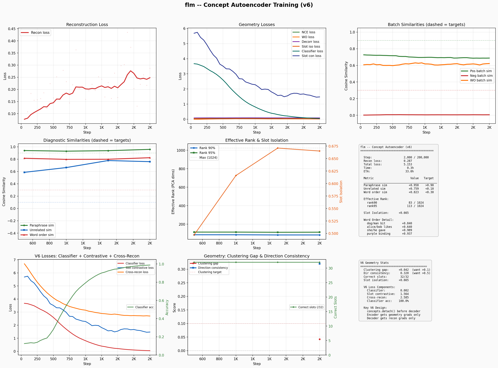

# flm — The Free Language Model

> **Status: Active training (Concept Autoencoder V6).** Training a concept autoencoder that compresses language into geometric concept vectors — a bottleneck where meaning determines position, not surface form.

A fully free AI project trained from scratch on a single RTX 3090. Every dataset DFSG-compliant, every weight reproducible. Built to be the first AI model you can `apt install` from Debian main.

**Free as in freedom** — the name is a direct reference to the Free Software Foundation's philosophy that software freedom is a matter of liberty, not price.

## Concept Autoencoder — Current Architecture

### The Idea

Instead of predicting tokens, encode language into a compressed geometric space where:
- **Each slot encodes a specific concept family** (size, color, tense, sentiment, etc.)
- **Paraphrases** map to nearby vectors (same meaning = close)
- **Unrelated sentences** map far apart
- **Word-order changes** that alter meaning are distinguishable

A stage 2 model (future) can then reason purely in concept space, never touching raw language.

### Architecture (~54.3M params)

Encoder (bidirectional) -> 32x32 Bottleneck -> Decoder (autoregressive)

| Component | Details |
|-----------|---------|
| Encoder | 6 layers, 384 hidden, 6 heads, SwiGLU FFN |
| Bottleneck | 32 learned queries cross-attend to encoder, project to 32-dim each |
| Decoder | 6 layers, 384 hidden, 6 heads, cross-attends to concept stack |
| Concept space | 32 slots x 32 dims = 1024-dim representation |
| Tokenizer | BERT base uncased (30,522 vocab) |
| Max sequence | 128 tokens |
| Positional encoding | RoPE |
| Normalization | RMSNorm |

### The 32 Concept Slots

Each slot owns one semantic family. Synthetic training data teaches the model which slot encodes what:

| Slot | Concept | Slot | Concept |
|------|---------|------|---------|
| 0 | Subject/Entity | 16 | Distance/Proximity |
| 1 | Object/Patient | 17 | Tense/Aspect |
| 2 | Animacy/Gender | 18 | Duration/Frequency |
| 3 | Age/Life Stage | 19 | Time Reference |
| 4 | Size/Scale | 20 | Number/Amount |
| 5 | Color/Brightness | 21 | Degree/Comparison |
| 6 | Shape/Form | 22 | Core Sentiment |
| 7 | Material/Texture | 23 | Specific Emotion |
| 8 | Weight/Density | 24 | Arousal/Energy |
| 9 | Temperature/Weather | 25 | Quality/Value |
| 10 | Action Type | 26 | Difficulty/Importance |
| 11 | Manner/Intensity | 27 | Negation/Truth |
| 12 | Speed/Completion | 28 | Certainty/Obligation |
| 13 | Direction/Path | 29 | Causation/Condition |
| 14 | Location/Scene | 30 | Formality/Register |
| 15 | Spatial Relations | 31 | Speech Act/Intent |

### Training Losses (V6)

**Key V6 innovation: detached geometry with gradient leak.**

The encoder and decoder train semi-independently. Geometry losses (classifier, contrastive, isolation) flow only to the encoder. Reconstruction gradients flow primarily to the decoder, with only 10% leaking to the encoder. This prevents reconstruction from overriding slot assignments while keeping the encoder information-rich.

Nine losses in two groups:

**Encoder losses** (geometry — gradients to encoder+bottleneck):
1. **Per-slot classifiers** (NEW): Auxiliary linear heads on each slot predict the concept_value label. Direct gradient telling each slot what to encode. 100% accuracy by step 1,000.
2. **Per-slot contrastive** (NEW): Same concept_value → similar slot vectors, different → far apart. Shapes within-slot geometry.
3. **Slot isolation**: Synthetic pairs where only one concept varies. Target slot should change, others stay the same. 2.15M synthetic pairs.
4. **Paraphrase InfoNCE**: Hard negatives from NLI contradictions and PAWS adversarial pairs.
5. **Word-order InfoNCE**: Swap 2 random content tokens, push original and swapped apart.
6. **Slot decorrelation**: Penalizes correlation between concept slots.
7. **STS graded similarity**: MSE between predicted and human-rated similarity scores.

**Decoder losses** (reconstruction — gradients mostly to decoder):
8. **Self-reconstruction** (cross-entropy): Decode concept vectors back to original tokens.
9. **Cross-reconstruction** (NEW): Encode paraphrase A, decode toward paraphrase B. Forces bottleneck to encode meaning, not surface form.

### Training Data (DFSG-compliant)

| Dataset | License | Pairs | Use |
|---------|---------|-------|-----|
| Synthetic concept axes | Generated | 2.15M | Slot isolation + classification |
| ParaNMT | CC-BY | ~5M | Paraphrase pairs |
| PAWS | Apache 2.0 | 108K | Hard paraphrase pairs |
| QQP | CC | 400K | Question paraphrases |
| Tatoeba | CC-BY | 350K | Cross-lingual pairs |

### Training Progress (Concept Autoencoder V6)

V6 uses detached geometry with gradient leak. Slot assignments reached 32/32 correct within 1,000 steps.

**Live Dashboard:** `python web_dashboard.py` then open http://localhost:8501

**Static Dashboard (V6)**



### Quick Start

```bash
# 1. Generate synthetic concept axis data
python generate_concept_data.py

# 2. Build paraphrase pair datasets
python build_pairs.py

# 3. Train concept autoencoder
python train_concept.py --fresh

# 4. Visualize concept space
python plot_concepts.py                    # static plot (latest checkpoint)

# 5. Training dashboard
python plot_training.py                    # V5 dashboard (auto-detects latest)
```

## Version History

### Concept Autoencoder V6 (current) — Detached Geometry
- Detached encoder/decoder training: geometry gradients to encoder only, recon to decoder (10% leak)
- Per-slot classifiers: auxiliary heads classify concept_value from slot vectors
- Per-slot contrastive: shapes within-slot geometry (same value → close, different → far)
- Cross-reconstruction: encode A, decode toward paraphrase B
- 32/32 slot assignments correct within 1,000 steps (V5 had ~3/10)
- New monitoring: clustering gap, direction consistency, slot assignment accuracy

### Concept Autoencoder V5 (archived) — 32-Slot Supervised Concepts
- 54.3M param encoder-decoder with 32x32 concept bottleneck
- Each slot assigned a specific concept family (size, color, tense, sentiment, etc.)
- 2.15M synthetic sentence pairs for slot isolation training
- Slot isolation loss teaches which slot encodes which concept
- Good reconstruction and rank, but slots didn't learn assigned concepts

### Concept Autoencoder V4 (archived) — Hard Negatives + Rank Pushing
- 8x128 bottleneck, hard negative InfoNCE, spectral spread / per-dim variance
- Rank plateaued at ~76-83 despite multiple rank-pushing approaches
- Demonstrated that unsupervised rank expansion has limits

### Concept Autoencoder V3 (archived) — Decorrelation Focus
- Added slot decorrelation and spectral spread losses
- Rank plateaued at 57-58; geometry probing showed lookup-table behavior

### Concept Autoencoder V2 (archived) — Scheduled Weights + Word-Order
- Minimal 2-token swap word-order contrastive loss
- Hard phase-based loss scheduling

### Concept Autoencoder V1 (archived) — Baseline
- Same architecture, no word-order loss, static weights

### V3 (stopped) — SmolLM-135M, Common Pile Data
- 135M params, reached loss 2.67 at 1.23B tokens

### V2 (mothballed) — 493M Dense Transformer
- 493M params, reached loss 2.70 at 3.5B tokens

### V1 (archived) — Tournament of 10 Architectures
- 164M winner, 9.8B tokens, Common Crawl (not DFSG-compliant)

## Key Lessons Learned

1. **Next-token prediction at small scale needs enormous data** — 100B+ tokens for coherent output from a 135M model.
2. **Bottleneck forces information encoding** — reconstruction loss ensures the concept vectors actually capture meaning, not just cluster statistics.
3. **Unsupervised rank expansion plateaus** — spectral spread (SVD sample cap), per-dim variance (scale shortcut), decorrelation (slot-level only) all plateau around rank 60-83. Supervised slot assignment may break through.
4. **Hard negatives beat random negatives** — NLI contradictions and PAWS adversarial pairs force finer semantic discrimination.
5. **Smooth weight scheduling beats hard phases** — continuous `1/(1+recon_loss)` ramp avoids phase-boundary instability.
6. **Full-shuffle word-order is too easy** — minimal 2-token swap provides sustained gradient.

## Project Structure

```
flm/
├── concept_model.py          # Concept autoencoder (54.3M, encoder-decoder)
├── train_v6.py               # V6 training (detached geometry + classifiers)
├── train_concept.py          # V5 training (archived)
├── generate_concept_data.py  # Synthetic concept axis dataset generator
├── plot_concepts.py          # UMAP concept space visualization
├── plot_training.py          # Training dashboard (static PNG)
├── web_dashboard.py          # Live web dashboard (auto-refresh)
├── probe_geometry.py         # Probe concept space geometry
├── probe_concepts.py         # Interactive concept probing
├── build_pairs.py            # Download DFSG paraphrase pair datasets
├── data/
│   ├── pairs/                # Paraphrase, hard negative, STS pairs
│   └── concept_axes/         # Synthetic slot isolation data (32 slots)
├── checkpoints/              # Model checkpoints (gitignored)
└── logs/                     # Training logs and plots
    ├── concept_v5.log        # Current training log
    └── plots/                # Generated dashboards
```

## License

GPL-3.0 — See [LICENSE](LICENSE) for details.

Built by David Hamner with help from Claude.
