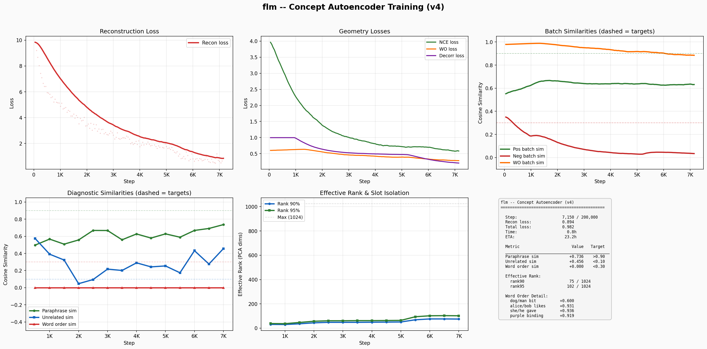

# flm — The Free Language Model

> **Status: Active training (Concept Autoencoder V4).** Training a concept autoencoder that compresses language into geometric concept vectors — a bottleneck where meaning determines position, not surface form.

A fully free AI project trained from scratch on a single RTX 3090. Every dataset DFSG-compliant, every weight reproducible. Built to be the first AI model you can `apt install` from Debian main.

**Free as in freedom** — the name is a direct reference to the Free Software Foundation's philosophy that software freedom is a matter of liberty, not price.

## Concept Autoencoder — Current Architecture

### The Idea

Instead of predicting tokens, encode language into a compressed geometric space where:
- **Paraphrases** map to nearby vectors (same meaning = close)
- **Unrelated sentences** map far apart
- **Word-order changes** that alter meaning (e.g., "dog bit man" vs "man bit dog") are distinguishable

A stage 2 model (future) can then reason purely in concept space, never touching raw language.

### Architecture (~54.8M params)

Encoder (bidirectional) -> 8x128 Bottleneck -> Decoder (autoregressive)

| Component | Details |
|-----------|---------|
| Encoder | 6 layers, 384 hidden, 6 heads, SwiGLU FFN |
| Bottleneck | 8 learned queries cross-attend to encoder, project to 128-dim each |
| Decoder | 6 layers, 384 hidden, 6 heads, cross-attends to concept stack |
| Concept space | 8 slots x 128 dims = 1024-dim representation |
| Tokenizer | BERT base uncased (30,522 vocab) |
| Max sequence | 128 tokens |
| Positional encoding | RoPE |
| Normalization | RMSNorm |

### Training Losses

Six losses trained jointly with smooth weight scheduling:

1. **Reconstruction** (cross-entropy): Decode concept vectors back to original tokens. Forces the bottleneck to encode ALL meaning — critical for word-order-dependent semantics.
2. **Paraphrase InfoNCE** (contrastive): Pull paraphrase/entailment pairs closer. Uses hard negatives (NLI contradictions, PAWS adversarial pairs) in the negative pool.
3. **Word-order InfoNCE** (contrastive): Swap 2 random content tokens, push original and swapped apart.
4. **Slot decorrelation**: Penalizes correlation between concept slots to prevent redundancy.
5. **Per-dimension variance**: Penalizes low-variance dimensions via `-log(var)`. Pushes the model to spread information across all 1024 dimensions, maximizing effective rank.
6. **STS graded similarity**: MSE between predicted and human-rated similarity scores for graded discrimination.

**Smooth weight scheduling** (no hard phases):
- `recon_weight = clamp(recon_loss, 0.2, 2.0)` — high when recon is bad, decays as it improves
- `geometry_weight = 1 / (1 + recon_loss)` — ramps up as reconstruction improves

### Training Data (DFSG-compliant)

| Dataset | License | Pairs | Use |
|---------|---------|-------|-----|
| ParaNMT | CC-BY | ~5M | Paraphrase pairs |
| PAWS | Apache 2.0 | 108K | Hard paraphrase pairs |
| QQP | CC | 400K | Question paraphrases |
| Tatoeba | CC-BY | 350K | Cross-lingual pairs |

### Training Progress (Concept Autoencoder V4)

V4 adds hard negative mining, per-dimension variance loss, and graded STS. Currently training.

**Training Dashboard (V4)**



### Quick Start

```bash
# 1. Build paraphrase pair datasets
python build_pairs.py

# 2. Train concept autoencoder
python train_concept.py --fresh

# 3. Visualize concept space
python plot_concepts.py                    # static plot (latest checkpoint)
python plot_concepts.py --animate          # video across all checkpoints

# 4. Training dashboard
python plot_training.py                    # V4 dashboard (auto-detects latest)
python plot_training.py --run v2           # V2 dashboard
```

## Version History

### Concept Autoencoder V4 (current) — Hard Negatives + Per-Dim Variance
- 54.8M param encoder-decoder with 8x128 concept bottleneck
- Hard negative InfoNCE with NLI contradictions and PAWS adversarial pairs
- Per-dimension variance loss to maximize effective rank (no sample cap)
- Graded STS similarity loss for fine-grained discrimination
- Smooth weight scheduling (no hard phase boundaries)

### Concept Autoencoder V3 (archived) — Decorrelation Focus
- Added slot decorrelation loss and spectral spread
- Rank plateaued at 57-58; geometry probing showed lookup-table behavior
- Logs preserved in `logs/concept_v3_final.log`

### Concept Autoencoder V2 (archived) — Scheduled Weights + Word-Order
- Minimal 2-token swap word-order contrastive loss
- Hard phase-based loss scheduling

### Concept Autoencoder V1 (archived) — Baseline
- Same architecture, no word-order loss, static weights

### V3 (stopped) — SmolLM-135M, Common Pile Data
- 135M params, reached loss 2.67 at 1.23B tokens
- Text still incoherent at 12% through training

### V2 (mothballed) — 493M Dense Transformer
- 493M params, reached loss 2.70 at 3.5B tokens
- Way too few tokens for model size

### V1 (archived) — Tournament of 10 Architectures
- 164M winner, trained on 9.8B tokens
- Used Common Crawl derivatives (not DFSG-compliant)

## Key Lessons Learned

1. **Next-token prediction at small scale needs enormous data** — 100B+ tokens for coherent output from a 135M model.
2. **Bottleneck forces information encoding** — reconstruction loss ensures the concept vectors actually capture meaning, not just cluster statistics. Critical for word-order semantics ("he punched her" vs "she punched him").
3. **Hard negatives beat random negatives** — NLI contradictions and PAWS adversarial pairs force finer semantic discrimination than random in-batch negatives.
4. **SVD-based rank loss has a sample cap problem** — spectral spread loss capped at 64 SVD samples can't push rank beyond ~83. Per-dimension variance (`-log(var)`) has no cap and directly targets all 1024 dims.
5. **Smooth weight scheduling beats hard phases** — V3's phase boundaries caused instability; V4's continuous `1/(1+recon_loss)` ramp is smoother.
6. **Full-shuffle word-order is too easy** — minimal 2-token swap provides sustained gradient vs trivially-detectable scrambled n-grams.

## Project Structure

```
flm/
├── concept_model.py          # Concept autoencoder (54.8M, encoder-decoder)
├── train_concept.py          # Autoencoder training with 6-loss system
├── plot_concepts.py          # UMAP concept space visualization + animation
├── plot_training.py          # Training dashboard (V1/V2 comparison)
├── probe_geometry.py          # Probe concept space geometry (clustering, directions, analogies)
├── probe_concepts.py         # Probe concept geometry interactively
├── probe_pretrained.py       # Probe pretrained sentence encoders
├── build_pairs.py            # Download DFSG paraphrase pair datasets
├── encoder_model.py          # V4 contrastive encoder (archived)
├── train_encoder.py          # V4 encoder training (archived)
├── model.py                  # V1-V3 decoder-only transformer
├── train_pretrain.py         # V1-V3 next-token pretraining
├── data/                     # Training data
├── checkpoints/              # Model checkpoints (gitignored)
└── logs/                     # Training logs and plots
    ├── concept_v4.log        # Current training log
    ├── concept_v3_final.log  # V3 archived log
    ├── concept_v2.log        # V2 archived log
    └── plots/                # Generated dashboards and visualizations
```

## License

GPL-3.0 — See [LICENSE](LICENSE) for details.

Built by David Hamner with help from Claude.
